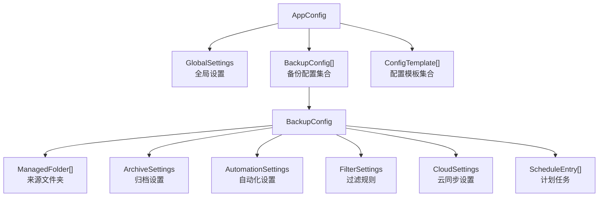

# 数据模型

## AppConfig 层级结构

`AppConfig` 是应用配置的根对象，持久化为 `config.json`：

## 核心模型说明

### AppConfig

配置根对象，包含全局设置和所有备份配置。

### BackupConfig

单个备份配置，描述一个备份任务的完整规则：

- `ManagedFolder[]`：要备份的来源文件夹列表
- `ArchiveSettings`：压缩格式、加密选项、输出路径
- `AutomationSettings`：自动备份的触发条件
- `FilterSettings`：文件包含/排除规则（`FileTypeRule[]`）
- `CloudSettings`：rclone 云同步配置
- `ScheduleEntry[]`：计划任务条目

### GlobalSettings

应用级全局设置：语言、主题、快捷键、启动行为等。

### ManagedFolder

单个来源文件夹：路径、启用状态、最后修改时间。

## 增量备份元数据

增量备份使用独立的元数据结构追踪文件变化：

| 模型 | 职责 |
|---|---|
| `BackupMetadata` | 单次增量备份的元数据 |
| `BackupMetadataState` | 元数据状态（完整/增量链中） |
| `BackupChangeRecord` | 单个文件的变更记录 |
| `FileState` | 文件状态（新增/修改/删除/未变） |

## 历史与任务

| 模型 | 职责 |
|---|---|
| `HistoryItem` | 单条备份历史记录（时间、大小、模式、状态） |
| `BackupTask` | 运行中的备份任务（进度、状态、错误信息） |

## 序列化

- 使用 `System.Text.Json` 进行所有模型的 JSON 序列化
- `AppJsonContext`（源生成器上下文）注册所有可序列化类型，实现 AOT 兼容
- 配置迁移逻辑处理旧版 JSON 格式到新版的自动转换

所有模型定义在 `Models/BackupModels.cs`（约 1300 行），增量元数据在 `Models/BackupMetadata.cs`。
