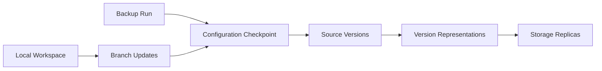

# 配置与不可变历史数据模型

## 用户配置

AppConfig含GlobalSettings、BackupConfigs及模板／预设集合。BackupConfig包含稳定Id、ConfigRevision、Kind、HostOrigin、ProviderStates、SourceFolders、Archive、Automation、Filters、BackupScope、Cloud、加密状态与HistoryRepositoryBinding。

ManagedFolder保持稳定Id、Path、DisplayName、SourceScope和Provider State。Kind为OwnerId+KindId；历史绑定只记录格式，不把设备仓库路径共享进配置。Settings与Provider State、DiscoveryOrigin与用户配置各自不同职责。

## 历史事实

```mermaid
flowchart LR
  Run[Backup Run] --> CP[Configuration Checkpoint]
  CP --> SV[Source Versions]
  SV --> Rep[Version Representations]
  Rep --> Copy[Storage Replicas]
  Branch[Branch Updates] --> CP
  WS[Local Workspace] --> Branch
```

一次Commit Pack公开Run、Version、Representation、Checkpoint、BranchUpdate等关联事实。表示有物理依赖和fidelity，源版本只描述逻辑状态；Replica lifecycle与本机Observation分开。History Annotation保存备注、Pin、展示策略，不改旧Version。

## 本机与缓存

History Index、Capture Baseline Cache可重建；Workspace和Local Replica Catalog是设备持久状态，不作共享历史。Safety Snapshot独立保护Checkpoint闭包，不推进活动分支。Config迁移与旧History迁移分别完成，不把旧HistoryItem列表当新模型。

插件公开快照来自Abstractions的不可变record，与Host可观察UI模型不同；禁止插件持有可写BackupConfig／ManagedFolder引用。

