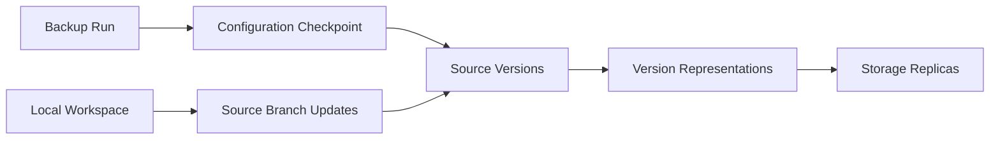

# 配置与不可变历史数据模型

理解用户配置、来源身份与不可变历史之间的关系，便于维护持久化数据和定位状态问题。

## 用户配置

AppConfig 含 GlobalSettings、BackupConfigs 及模板／预设集合。BackupConfig 包含稳定 Id、ConfigRevision、Kind、HostOrigin、ProviderStates、SourceFolders、Archive、Automation、Filters、BackupScope、Cloud、加密状态与 HistoryRepositoryBinding。

ManagedFolder 保持稳定 Id、Path、DisplayName、SourceScope 和 Provider State。Kind 为 OwnerId+KindId；历史绑定只记录格式，不把设备仓库路径共享进配置。Settings 与 Provider State、DiscoveryOrigin 与用户配置各自不同职责。

## 历史事实

```mermaid
flowchart LR
  Run[Backup Run] --> CP[Configuration Checkpoint]
  CP --> SV[Source Versions]
  SV --> Rep[Version Representations]
  Rep --> Copy[Storage Replicas]
  Branch[Source Branch Updates] --> SV
  WS[Local Workspace] --> Branch
```

一次 Commit Pack 公开 Run、Version、Representation、Checkpoint、BranchUpdate 等关联事实。表示有物理依赖和 fidelity，源版本只描述逻辑状态；Replica lifecycle 与本机 Observation 分开。History Annotation 保存备注、Pin、展示策略，不改旧 Version。

## 本机与缓存

History Index、Capture Baseline Cache 可重建；Workspace 和 Local Replica Catalog 是设备持久状态，不作共享历史。Safety Snapshot 独立保护 Checkpoint 闭包，不推进活动分支。Config 迁移与旧 History 迁移分别完成，不把旧 HistoryItem 列表当新模型。

插件公开快照来自 Abstractions 的不可变 record，与 Host 可观察 UI 模型不同；禁止插件持有可写 BackupConfig／ManagedFolder 引用。

## 来源拥有分支

每个来源维护自己的分支与本机基线，同一项目中的两个来源可以各有 `main`。备份、检出或合并一个来源不切换另一个来源的分支。普通还原更新内容基线，保留活动分支；Checkout 才切换分支。配置检查点与备份批次关联参与来源，未参与来源不计作失败。
