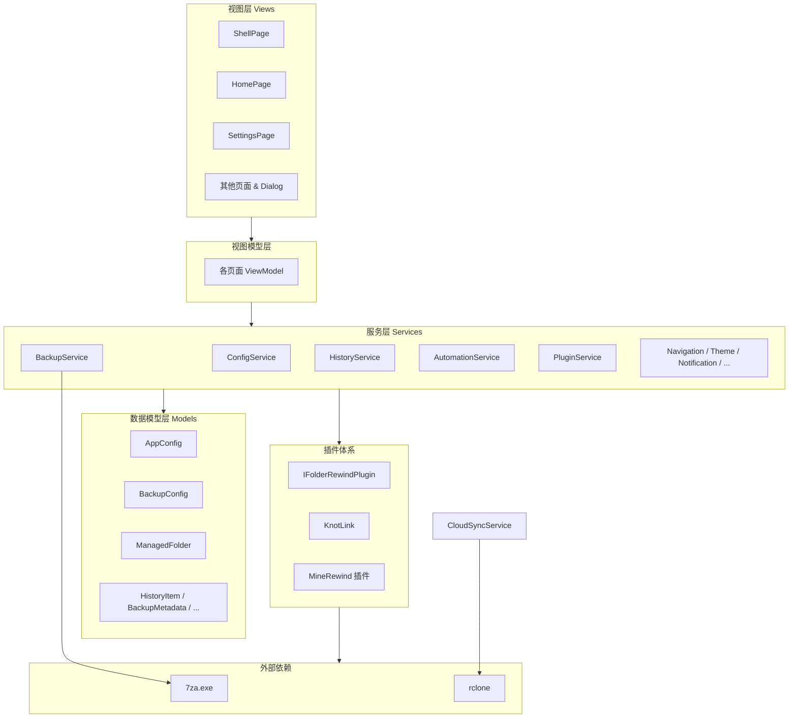

# 架构总览

**FolderRewind（存档时光机）** 是一个基于 WinUI 3 的 Windows 备份管理工具，采用 MVVM 架构，通过静态服务层组织业务逻辑，支持插件扩展和远程命令协议。

## 技术栈

| 类别 | 技术 | 版本 |
|---|---|---|
| 框架 | .NET + Windows App SDK | .NET 10 / WinAppSDK 2.1.3 |
| UI | WinUI 3 | — |
| MVVM | CommunityToolkit.Mvvm | 8.4.2 |
| 压缩引擎 | 7-Zip（7za.exe） | 捆绑 |
| 云同步 | rclone | 用户自备 |
| 系统托盘 | H.NotifyIcon.WinUI | 2.4.1 |
| 序列化 | System.Text.Json + 源生成器 | — |
| 设置控件 | CommunityToolkit.WinUI.SettingsControls | 8.2.251219 |

## 架构鸟瞰

## 文档导航

| 文档 | 内容 |
|---|---|
| [目录结构](./directory-structure.md) | 项目文件树与各目录职责 |
| [架构模式](./patterns.md) | MVVM、静态服务、Shell 导航等核心设计模式 |
| [命名空间参考](./namespaces.md) | 命名空间划分与关键类速查 |
| [服务层概览](./services.md) | 40+ 服务按功能域分组说明 |
| [插件体系](./plugin-system.md) | 插件接口、生命周期与 KnotLink 协议 |
| [数据模型](./data-models.md) | AppConfig 层级结构与序列化策略 |
| [视图层与导航](./views.md) | 页面列表、Dialog 与导航流程 |
