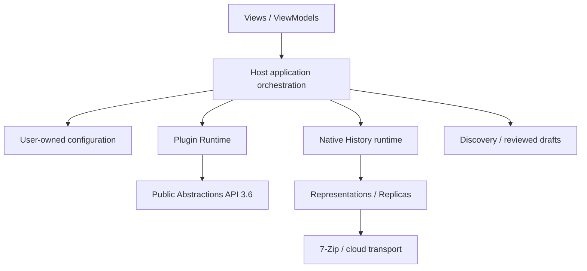

# 架构总览

FolderRewind是.NET10／WinUI3 Windows应用，当前项目Windows App SDK2.5.1。UI使用MVVM与可测试命令编排，核心历史和插件运行时通过实例服务与显式依赖组织；不能把所有业务解释成静态单例。

```mermaid
flowchart TD
  V[Views / ViewModels] --> H[Host application orchestration]
  H --> C[User-owned configuration]
  H --> N[Native History runtime]
  H --> P[Plugin Runtime]
  P --> A[Public Abstractions API 3.6]
  N --> R[Representations / Replicas]
  R --> Z[7-Zip / cloud transport]
  H --> D[Discovery / reviewed drafts]
```

## 边界

Host、SDK、Runtime与MineRewind独立产品／构建边界。SDK仅BCL，net10.0；Runtime可无WinUI测试；第三方插件只依赖SDK。Host使用固定哈希.frplugin验收，不以插件应用源码作为构建输入。

配置由用户拥有；发现提出候选，插件对账提出修订提案。Native History用不可变事实与可重建索引；设备Workspace与共享分支区分。还原由Host先物化／校验，再在操作门内修改目标；插件不能绕过。

查看[目录](/docs/architecture/directory-structure)、[模式](/docs/architecture/patterns)、[服务](/docs/architecture/services)、[模型](/docs/architecture/data-models)与[插件体系](/docs/architecture/plugin-system)。

