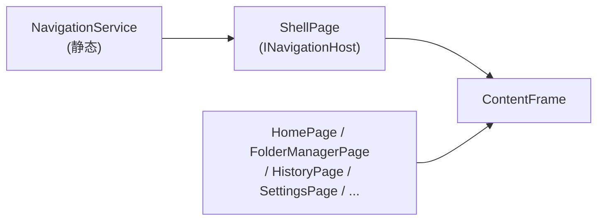

# 架构模式

## MVVM 模式

FolderRewind 使用 **CommunityToolkit.Mvvm** 实现 MVVM 模式。

- 所有 ViewModel 继承 `ViewModelBase`（扩展 `ObservableObject`）
- `ViewModelBase` 提供 `EnqueueOnUiThread()` 方法，通过 `UiDispatcherService` 将操作调度到 UI 线程
- 使用 `[ObservableProperty]` 源生成器特性自动生成属性和通知代码
- XAML.cs 代码仅用于 UI 事件桥接，业务逻辑放在 Service 或 ViewModel 中

## 静态服务架构

应用使用**静态服务**而非依赖注入（DI）：

- 几乎所有服务都是静态类 + 静态方法（如 `ConfigService.Load()`、`BackupService.RunBackup()`）
- 服务在 `App.OnLaunched()` 中手动初始化
- 使用 `UiDispatcherService` 作为非 UI 服务向 UI 线程投递操作的集中调度点

选择静态服务的原因：WinUI 3 应用生命周期较短，服务间依赖关系简单，静态调用更直接。

## Shell 导航模式

- `ShellPage` 是导航宿主，包含 `NavigationView` 和 `ContentFrame`
- `NavigationService` 是静态服务，持有当前 `INavigationHost` 引用
- 页面通过字符串 tag 标识（"Home"、"Manager"、"Tasks"、"History"、"Logs"、"Settings"）
- 导航请求通过 `NavigationService.NavigateTo(tag)` 发起

## 配置驱动

整个应用状态持久化在单个 `config.json` 文件中：

- `ConfigService` 是配置的"单一真相源"
- 顶层 `AppConfig` 包含 `GlobalSettings`、`BackupConfig[]`、`ConfigTemplate[]`
- 支持旧版配置格式的自动迁移
- 提供导入/导出功能

## 部分类组织

复杂服务使用 C# 部分类（partial class）拆分到多个文件中，以 `BackupService` 为典型：

| 文件 | 职责 |
|---|---|
| `BackupService.cs` | 主编排（备份/还原入口） |
| `BackupService.Archive.cs` | 7-Zip 归档创建 |
| `BackupService.Filtering.cs` | 文件包含/排除逻辑 |
| `BackupService.Helpers.cs` | 工具方法 |
| `BackupService.Metadata.cs` | 增量备份元数据管理 |
| `BackupService.Pruning.cs` | 旧归档清理 |
| `BackupService.Restore.cs` | 还原逻辑 |

## 序列化策略

- 使用 `System.Text.Json` 进行所有模型的 JSON 序列化
- 通过 `AppJsonContext`（源生成器上下文）实现 AOT 兼容的序列化
- 所有可序列化类型在 `AppJsonContext` 中注册
- 配置迁移逻辑处理旧版 JSON 格式到新版的转换
