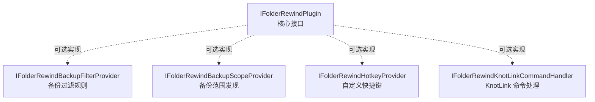

# 插件体系

## 接口层次

插件系统围绕 `IFolderRewindPlugin` 核心接口构建，辅以可选的扩展接口：

### 核心接口 `IFolderRewindPlugin`

插件必须实现的核心接口，定义：

- **生命周期钩子**：`InitializeAsync()` / `UnloadAsync()`
- **备份/还原钩子**：`OnBeforeBackupAsync()` / `OnAfterBackupAsync()` / `OnBeforeRestoreAsync()` / `OnAfterRestoreAsync()`
- **完全接管**：`CanTakeOverBackup()` / `TakeOverBackupAsync()` — 插件可完全接管特定配置的备份/还原流程
- **配置类型发现**：`GetCustomConfigTypes()` — 注册自定义配置类型
- **设置页贡献**：`GetSettingsSections()` — 在设置中展示插件自己的配置界面

## 生命周期

- **扫描**：`PluginService` 启动时扫描插件目录
- **安装**：支持从 zip 包安装，自动解压到插件目录
- **加载**：使用 `AssemblyLoadContext` 实现插件隔离加载
- **启用/禁用**：运行时切换，无需重启应用
- **版本检查**：通过 GitHub Release 检查插件更新
- **设置持久化**：插件设置由宿主应用持久化管理

## 插件隔离

使用 .NET 的 `AssemblyLoadContext` 实现：

- 每个插件在独立的 AssemblyLoadContext 中加载
- 插件的依赖不会与宿主或其他插件冲突
- 插件卸载时可释放加载的程序集（支持热更新场景）

## KnotLink 协议

KnotLink 是一个基于 TCP 的远程命令/事件协议，继承自 MineBackup：

- **信号发送**（`SignalSender`）：向外部工具发送备份/还原事件通知
- **信号订阅**（`SignalSubscriber`）：监听外部工具发来的命令
- **命令解析**（`KnotLinkCommandParser`）：解析 TCP 消息为结构化命令
- **TCP 通信**（`TcpClient`、`OpenSocketQuerier`、`OpenSocketResponser`）：底层网络通信

典型场景：Minecraft 模组在游戏运行时触发热备份/热还原。

## 参考插件：MineRewind

`FolderRewind-Plugin-Minecraft/MineRewind/` 是官方 Minecraft 存档管理插件，可作为插件开发的参考实现：

- 实现了 `IFolderRewindPlugin` 的完全接管能力
- 处理 Minecraft 存档的特殊备份/还原逻辑
- 集成了 KnotLink 命令处理
