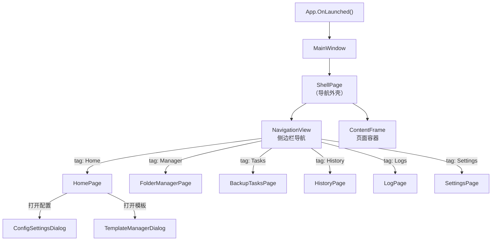

# 视图层与导航

## 页面列表

| 页面 | 文件 | 导航 Tag | 对应 ViewModel | 说明 |
|---|---|---|---|---|
| 首页 | `HomePage.xaml` | `Home` | `HomePageViewModel` | 所有备份配置的仪表盘卡片 |
| 文件夹管理 | `FolderManagerPage.xaml` | `Manager` | `FolderManagerViewModel` | 管理备份配置中的来源文件夹 |
| 备份任务 | `BackupTasksPage.xaml` | `Tasks` | `BackupTasksViewModel` | 运行中的备份任务与进度 |
| 历史记录 | `HistoryPage.xaml` | `History` | `HistoryViewModel` | 备份历史时间线与还原 |
| 日志 | `LogPage.xaml` | `Logs` | `LogViewModel` | 应用日志查看器 |
| 设置 | `SettingsPage.xaml` | `Settings` | `SettingsViewModel` | 应用设置（含子控件） |
| 迷你窗口 | `MiniWindow.xaml` | — | — | 独立浮动窗口，快速备份触发 |
| 插件商店 | `PluginStorePage.xaml` | — | `PluginStoreViewModel` | 插件发现与管理 |

## 对话框

| 对话框 | 文件 | 用途 |
|---|---|---|
| 配置编辑 | `ConfigSettingsDialog.xaml` | 创建/编辑备份配置 |
| 云同步配置 | `ConfigCloudSyncDialog.xaml` | 配置 rclone 云同步 |
| 模板管理 | `TemplateManagerDialog.xaml` | 管理配置模板 |
| 模板提交 | `TemplateSubmissionDialog.xaml` | 提交模板到社区 |

## 设置页子控件

`SettingsPage` 通过子控件组织各项设置：

| 子控件 | 文件 | 职责 |
|---|---|---|
| `AboutControl` | `Settings/AboutControl.xaml` | 版本信息与关于 |
| `AppearanceLayoutControl` | `Settings/AppearanceLayoutControl.xaml` | 主题、字体、窗口尺寸 |
| `CoreBehaviorControl` | `Settings/CoreBehaviorControl.xaml` | 核心备份行为设置 |
| `DataManagementControl` | `Settings/DataManagementControl.xaml` | 配置导入/导出、数据管理 |
| `DiagnosticsControl` | `Settings/DiagnosticsControl.xaml` | 诊断与校验 |
| `PluginsKnotLinkControl` | `Settings/PluginsKnotLinkControl.xaml` | 插件系统与 KnotLink 设置 |
| `PresetSettingsControl` | `Settings/PresetSettingsControl.xaml` | Minecraft 预设与模板设置 |
| `RuntimeEnvControl` | `Settings/RuntimeEnvControl.xaml` | 运行环境（7z 路径、rclone 路径） |

## 导航流程

## 特殊窗口

- **MiniWindow**：独立于主窗口的浮动小窗口，由 `MiniWindowService` 管理。每个 MiniWindow 绑定一个文件夹，提供一键备份按钮。不通过 `NavigationService` 路由。
- **SponsorWindow**：赞助版信息窗口，由 `MainWindowService` 管理生命周期。
