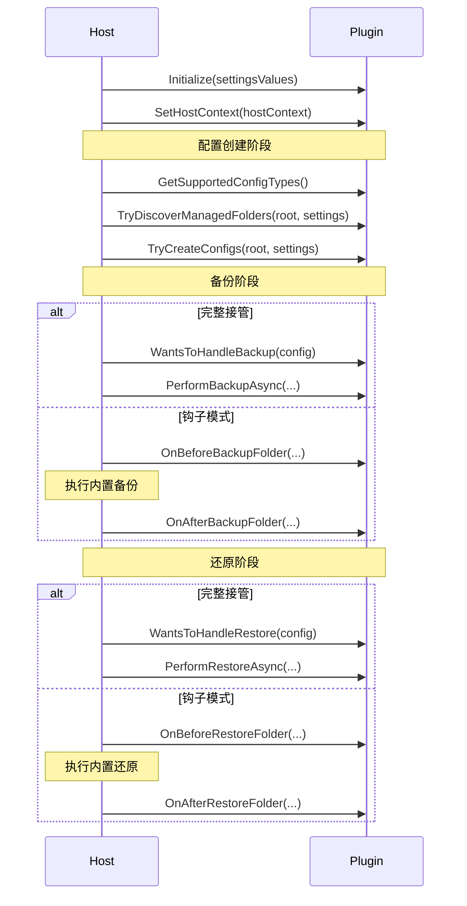

# Plugin API 参考

本文档基于 `IFolderRewindPlugin.cs` 的当前实现，覆盖插件主接口的所有成员。

## 接口定位

`IFolderRewindPlugin` 是插件的核心入口，定义：

- 插件元信息与设置
- 生命周期初始化
- 备份/还原钩子
- 配置类型发现与创建
- （可选）完整接管备份/还原流程

## 最小实现

```csharp
using FolderRewind.Models;
using FolderRewind.Services.Plugins;

public class MyPlugin : IFolderRewindPlugin
{
    public PluginInstallManifest Manifest { get; } = new()
    {
        Id = "com.example.myplugin",
        Name = "MyPlugin",
        Version = "1.0.0",
        Author = "You",
        Description = "My first plugin",
        EntryAssembly = "MyPlugin.dll",
        EntryType = "MyPlugin.MyPlugin"
    };

    public IReadOnlyList<PluginSettingDefinition> GetSettingsDefinitions()
        => new List<PluginSettingDefinition>();

    public void Initialize(IReadOnlyDictionary<string, string> settingsValues) { }

    public string? OnBeforeBackupFolder(BackupConfig config, ManagedFolder folder,
        IReadOnlyDictionary<string, string> settingsValues) => null;

    public void OnAfterBackupFolder(BackupConfig config, ManagedFolder folder,
        bool success, string? generatedArchiveFileName,
        IReadOnlyDictionary<string, string> settingsValues) { }

    public IReadOnlyList<ManagedFolder> TryDiscoverManagedFolders(string selectedRootPath,
        IReadOnlyDictionary<string, string> settingsValues)
        => new List<ManagedFolder>();
}
```

上述 6 个成员是**必须实现**的（没有默认实现）。其余成员均有默认实现，按需覆盖。

## Manifest 属性

`PluginInstallManifest` 用于 UI 展示、日志记录和兼容性检查。

```csharp
public PluginInstallManifest Manifest { get; } = new()
{
    Id = "com.example.myplugin",       // 全局唯一，反向域名风格
    Name = "MyPlugin",                  // 显示名称
    Version = "1.0.0",                  // 语义化版本
    Author = "You",                     // 作者
    Description = "...",                // 一句话描述
    EntryAssembly = "MyPlugin.dll",     // 入口 DLL 文件名
    EntryType = "MyPlugin.MyPlugin",    // 入口类型完全限定名
    MinHostVersion = "1.7.3",           // 可选：最低宿主版本
    Homepage = "https://...",           // 可选：主页链接
    Repository = "owner/repo",          // 可选：GitHub 仓库（用于自动更新）
    LocalizedName = new()               // 可选：多语言名称
    {
        ["zh-CN"] = "我的插件",
        ["en-US"] = "My Plugin"
    },
    LocalizedDescription = new()        // 可选：多语言描述
    {
        ["zh-CN"] = "一个示例插件",
        ["en-US"] = "A sample plugin"
    }
};
```

:::info
`Manifest` 属性中的 `EntryAssembly` 和 `EntryType` 必须与 `manifest.json` 中的值一致，否则插件无法加载。
:::

## GetSettingsDefinitions()

声明插件的可配置项。Host 会自动渲染设置 UI，并在调用插件方法时通过 `settingsValues` 回传。

```csharp
public IReadOnlyList<PluginSettingDefinition> GetSettingsDefinitions()
{
    return new List<PluginSettingDefinition>
    {
        new()
        {
            Key = "EnableFeature",           // 设置键名（发布后尽量不改）
            DisplayName = "启用功能",         // UI 显示名
            Description = "开启后将...",      // 用途说明
            Type = PluginSettingType.Boolean, // 类型
            DefaultValue = "true",           // 默认值（字符串）
            IsRequired = false               // 是否必填
        }
    };
}
```

**PluginSettingType 枚举：**

| 值 | 说明 | DefaultValue 格式 |
|----|------|-------------------|
| `String` | 单行文本 | 任意字符串 |
| `Boolean` | 布尔开关 | `"true"` / `"false"` |
| `Integer` | 整数 | 数字字符串，如 `"42"` |
| `Path` | 目录路径 | 路径字符串 |
| `MultilineString` | 多行文本 | 包含换行的字符串 |

## Initialize(settingsValues)

插件被启用时调用一次。用于读取设置、预热状态。

```csharp
private bool _enableFeature;

public void Initialize(IReadOnlyDictionary<string, string> settingsValues)
{
    _enableFeature = settingsValues.TryGetValue("EnableFeature", out var v)
        && string.Equals(v, "true", StringComparison.OrdinalIgnoreCase);
}
```

**注意事项：**
- `settingsValues` 的 Value 始终是 `string` 类型
- 布尔值建议同时兼容 `"true"/"false"` 和 `"1"/"0"`
- 数值设置建议做边界检查

## SetHostContext(hostContext)

Host 在加载插件后注入 `PluginHostContext`。插件可缓存此对象用于主动操作。

```csharp
private PluginHostContext? _hostContext;

public void SetHostContext(PluginHostContext hostContext)
{
    _hostContext = hostContext;
}
```

### PluginHostContext API

| 成员 | 类型 | 说明 |
|------|------|------|
| `PluginId` | `string` | 当前插件 ID |
| `PluginName` | `string` | 当前插件名称 |
| `IsKnotLinkAvailable` | `bool` | KnotLink 是否可用 |
| `IsKnotLinkSenderReady` | `bool` | KnotLink 发送器是否就绪 |
| `IsKnotLinkResponserReady` | `bool` | KnotLink 响应器是否就绪 |
| `BroadcastEvent(eventData)` | `void` | 广播 KnotLink 事件 |
| `BroadcastEventAsync(eventData)` | `Task` | 异步广播事件 |
| `QueryKnotLinkAsync(question, timeoutMs)` | `Task<string>` | 请求-响应式查询 |
| `SubscribeSignal(signalId, onSignal)` | `IDisposable?` | 订阅信号通道（返回订阅对象，Dispose 取消） |
| `SendKnotLinkCommand(message)` | `void` | 发送 KnotLink 命令（异步执行，不等待响应） |
| `LogInfo(message)` | `void` | 记录信息日志 |
| `LogWarning(message)` | `void` | 记录警告日志 |
| `LogError(message, ex?)` | `void` | 记录错误日志 |

## 备份钩子

### OnBeforeBackupFolder

```csharp
string? OnBeforeBackupFolder(
    BackupConfig config,
    ManagedFolder folder,
    IReadOnlyDictionary<string, string> settingsValues);
```

- 返回 `null`：使用原始路径备份
- 返回新路径：Host 将该路径作为备份源（用于快照目录替换）

### OnAfterBackupFolder

```csharp
void OnAfterBackupFolder(
    BackupConfig config,
    ManagedFolder folder,
    bool success,
    string? generatedArchiveFileName,
    IReadOnlyDictionary<string, string> settingsValues);
```

- `success`：备份是否成功
- `generatedArchiveFileName`：生成的归档文件名（成功时非空）
- 常见用途：清理临时快照、写入附加元数据、记录日志

## 还原钩子

### OnBeforeRestoreFolder

```csharp
object? OnBeforeRestoreFolder(
    BackupConfig config,
    ManagedFolder folder,
    string archiveFileName,
    IReadOnlyDictionary<string, string> settingsValues)
    => null;
```

- 返回任意状态对象（`object`），在还原后传递给 `OnAfterRestoreFolder`
- 返回 `null` 表示不需要还原后处理
- 常见用途：提取需要保留的用户数据

### OnAfterRestoreFolder

```csharp
void OnAfterRestoreFolder(
    BackupConfig config,
    ManagedFolder folder,
    bool success,
    string archiveFileName,
    object? state,
    IReadOnlyDictionary<string, string> settingsValues)
{ }
```

- `state`：`OnBeforeRestoreFolder` 返回的对象
- `success`：还原是否成功
- 常见用途：将之前保存的数据写回

## 配置类型发现

### GetSupportedConfigTypes / CanHandleConfigType

```csharp
IReadOnlyList<string> GetSupportedConfigTypes() => Array.Empty<string>();
bool CanHandleConfigType(string configType) => false;
```

用于定义插件专属配置类型。例如 MineRewind 返回 `["Minecraft Saves"]`。

### TryDiscoverManagedFolders

```csharp
IReadOnlyList<ManagedFolder> TryDiscoverManagedFolders(
    string selectedRootPath,
    IReadOnlyDictionary<string, string> settingsValues);
```

用户选择目录后，插件自动发现可管理的文件夹列表。

### TryCreateConfigs

```csharp
PluginCreateConfigResult TryCreateConfigs(
    string selectedRootPath,
    IReadOnlyDictionary<string, string> settingsValues)
    => new PluginCreateConfigResult { Handled = false };
```

一键批量创建 `BackupConfig`。返回 `Handled = true` 时 Host 使用 `CreatedConfigs`。

## 完整接管（高级）

当以下方法返回 `true` 时，Host 跳过内置引擎，完全由插件处理：

```csharp
bool WantsToHandleBackup(BackupConfig config) => false;
bool WantsToHandleRestore(BackupConfig config) => false;
```

随后调用：

```csharp
Task<PluginBackupResult> PerformBackupAsync(
    BackupConfig config,
    ManagedFolder folder,
    string comment,
    IReadOnlyDictionary<string, string> settingsValues,
    Action<double, string>? progressCallback = null);

Task<PluginRestoreResult> PerformRestoreAsync(
    BackupConfig config,
    ManagedFolder folder,
    string archiveFileName,
    IReadOnlyDictionary<string, string> settingsValues,
    Action<double, string>? progressCallback = null);
```

`progressCallback` 用于报告进度：`progressCallback(0.5, "正在复制文件...")` 表示 50% 进度。

### 结果类型

```csharp
// 备份结果
public class PluginBackupResult
{
    public bool Success { get; set; }
    public string? GeneratedFileName { get; set; }  // 归档文件名
    public string? Message { get; set; }             // 状态消息
}

// 还原结果
public class PluginRestoreResult
{
    public bool Success { get; set; }
    public string? Message { get; set; }
}

// 配置创建结果
public class PluginCreateConfigResult
{
    public bool Handled { get; set; }
    public IReadOnlyList<BackupConfig>? CreatedConfigs { get; set; }
    public string? Message { get; set; }
}
```

## 调用时序



## 常见陷阱

- **钩子中阻塞过久**：备份/还原钩子在主流程中调用，长时间阻塞会卡住整个任务
- **未处理异常**：插件抛出未捕获异常会影响用户体验，建议用 try-catch 包裹所有钩子
- **settingsValues 解析不健壮**：布尔值建议兼容 `"true"/"false"/"1"/"0"`，数值设置做边界检查
- **版本声明过宽**：`MinHostVersion` 设置过低可能导致在旧 Host 上调用不存在的 API
- **AssemblyLoadContext 隔离**：插件和 Host 使用不同的 ALC，不要假设共享程序集实例

## 相关链接

- [插件开发快速上手](./quick-start)
- [实战教程](./tutorial)
- [Hotkey API](./hotkey-api)
- [KnotLink Command API](./knotlink-api)
- [插件配置定义](./settings-schema)
