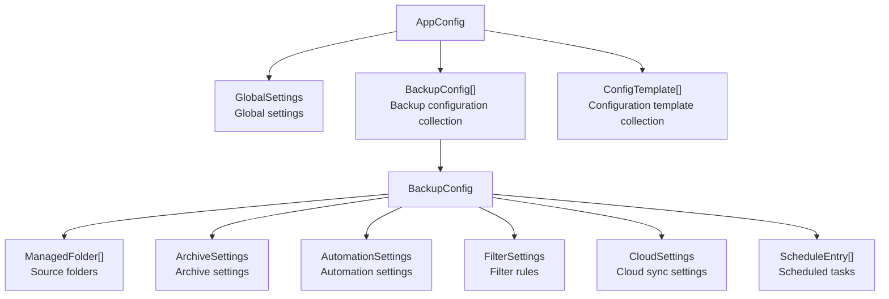

# Data Models

## AppConfig Hierarchy

`AppConfig` is the root configuration object, persisted as `config.json`:

## Core Model Descriptions

### AppConfig

Root configuration object containing global settings and all backup configurations.

### BackupConfig

A single backup configuration describing the complete rules for a backup task:

- `ManagedFolder[]`: List of source folders to back up
- `ArchiveSettings`: Compression format, encryption options, output path
- `AutomationSettings`: Trigger conditions for automatic backups
- `FilterSettings`: File inclusion/exclusion rules (`FileTypeRule[]`)
- `CloudSettings`: rclone cloud sync configuration
- `ScheduleEntry[]`: Scheduled task entries

### GlobalSettings

Application-level global settings: language, theme, keyboard shortcuts, startup behavior, etc.

### ManagedFolder

A single source folder: path, enabled state, last modified time.

## Incremental Backup Metadata

Incremental backups use a separate metadata structure to track file changes:

| Model | Responsibility |
|---|---|
| `BackupMetadata` | Metadata for a single incremental backup |
| `BackupMetadataState` | Metadata state (complete / part of an incremental chain) |
| `BackupChangeRecord` | Change record for a single file |
| `FileState` | File state (added / modified / deleted / unchanged) |

## History and Tasks

| Model | Responsibility |
|---|---|
| `HistoryItem` | A single backup history entry (timestamp, size, mode, status) |
| `BackupTask` | A running backup task (progress, status, error info) |

## Serialization

- All models are serialized to JSON using `System.Text.Json`
- `AppJsonContext` (source generator context) registers all serializable types for AOT compatibility
- Configuration migration logic handles automatic conversion from legacy JSON formats to the current version

All model definitions are located in `Models/BackupModels.cs` (approximately 1300 lines); incremental metadata is in `Models/BackupMetadata.cs`.
