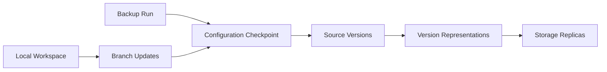

# Configuration and immutable history models

## User configuration

AppConfig holds GlobalSettings, BackupConfigs and templates/presets. BackupConfig includes stableId, ConfigRevision, Kind, HostOrigin, ProviderStates, SourceFolders, Archive, Automation, Filters, BackupScope, Cloud, encryption and HistoryRepositoryBinding.

ManagedFolder has stableId/Path/DisplayName/SourceScope/state. Kind is OwnerId+KindId; history binding stores format rather than sharing machine repository paths. Settings/state and discovery/user ownership differ.

## History facts

```mermaid
flowchart LR
  Run[Backup Run] --> CP[Configuration Checkpoint]
  CP --> SV[Source Versions]
  SV --> Rep[Version Representations]
  Rep --> Copy[Storage Replicas]
  Branch[Branch Updates] --> CP
  WS[Local Workspace] --> Branch
```

A Commit Pack publishes related Run/Version/Representation/Checkpoint/BranchUpdate facts. Representations carry physical dependencies/fidelity; Versions are logical state. Replica lifecycle differs from local observations. Annotations update comments/Pins/presentation without rewriting Versions.

## Local state and caches

Index/Capture Baseline Cache are rebuildable; Workspace/Local Replica Catalog are local durable state, not shared history. Safety points protect Checkpoint closure without branch advancement. Config/history migration are separate; the legacy HistoryItem list is not the new model.

Public Abstractions record snapshots differ from observable Host models; plugins never retain writable BackupConfig/ManagedFolder references.

