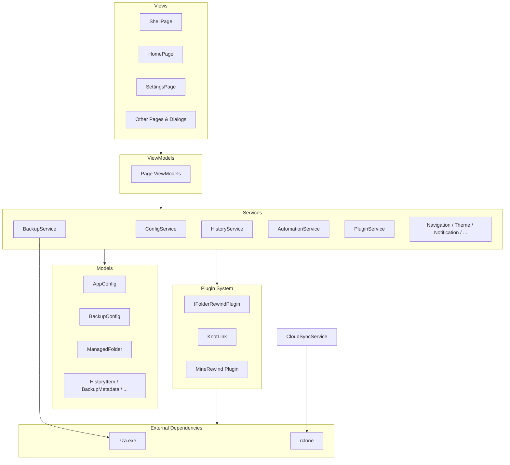

# Architecture Overview

**FolderRewind** is a WinUI 3-based Windows backup management tool. It adopts the MVVM architecture, organizes business logic through a static service layer, and supports plugin extensions and a remote command protocol.

## Tech Stack

| Category | Technology | Version |
|---|---|---|
| Framework | .NET + Windows App SDK | .NET 10 / WinAppSDK 2.1.3 |
| UI | WinUI 3 | — |
| MVVM | CommunityToolkit.Mvvm | 8.4.2 |
| Compression Engine | 7-Zip (7za.exe) | Bundled |
| Cloud Sync | rclone | User-provided |
| System Tray | H.NotifyIcon.WinUI | 2.4.1 |
| Serialization | System.Text.Json + Source Generator | — |
| Settings Controls | CommunityToolkit.WinUI.SettingsControls | 8.2.251219 |

## Architecture Bird's-Eye View

## Documentation Navigation

| Document | Content |
|---|---|
| [Directory Structure](./directory-structure.md) | Project file tree and directory responsibilities |
| [Architecture Patterns](./patterns.md) | MVVM, static services, Shell navigation, and other core design patterns |
| [Namespace Reference](./namespaces.md) | Namespace layout and key class quick reference |
| [Service Layer Overview](./services.md) | 40+ services grouped by functional domain |
| [Plugin System](./plugin-system.md) | Plugin interface, lifecycle, and KnotLink protocol |
| [Data Models](./data-models.md) | AppConfig hierarchy and serialization strategy |
| [Views & Navigation](./views.md) | Page list, dialogs, and navigation flow |
