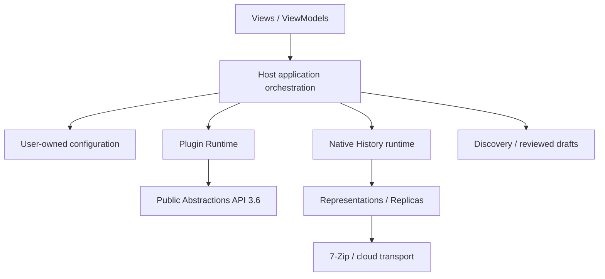

# Architecture overview

FolderRewind is .NET10/WinUI3 on Windows, with Windows App SDK2.5.1 in the current project. MVVM and testable command orchestration serve the UI; history/plugin cores use instance services and explicit dependencies, not blanket static-singleton architecture.

```mermaid
flowchart TD
  V[Views / ViewModels] --> H[Host application orchestration]
  H --> C[User-owned configuration]
  H --> N[Native History runtime]
  H --> P[Plugin Runtime]
  P --> A[Public Abstractions API 3.6]
  N --> R[Representations / Replicas]
  R --> Z[7-Zip / cloud transport]
  H --> D[Discovery / reviewed drafts]
```

## Boundaries

Host/SDK/Runtime/MineRewind have independent product/build boundaries. SDK is BCL-only net10.0; Runtime tests need no WinUI; external plugins reference SDK only. Host acceptance consumes fixed-hash .frplugin without plugin application source as build input.

Users own configs; discovery/reconciliation propose candidates/revision changes. Native history separates immutable shared facts, disposable indexes and local Workspace. The Host materializes/verifies before gated mutation; plugins cannot bypass it.

See [directories](/docs/architecture/directory-structure), [patterns](/docs/architecture/patterns), [services](/docs/architecture/services), [models](/docs/architecture/data-models), [plugins](/docs/architecture/plugin-system).

