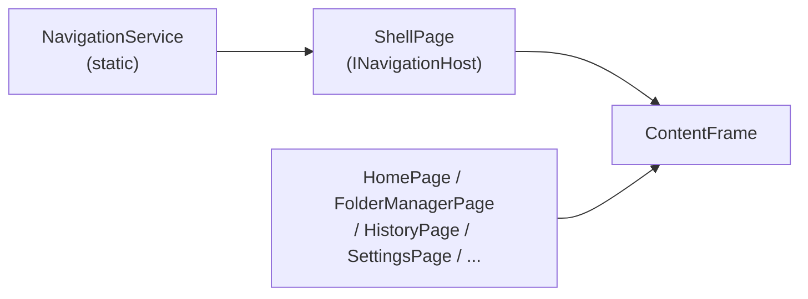

# Architectural Patterns

## MVVM Pattern

FolderRewind uses **CommunityToolkit.Mvvm** to implement the MVVM pattern.

- All ViewModels inherit from `ViewModelBase` (which extends `ObservableObject`)
- `ViewModelBase` provides an `EnqueueOnUiThread()` method that dispatches operations to the UI thread via `UiDispatcherService`
- The `[ObservableProperty]` source-generator attribute is used to auto-generate properties and change-notification code
- XAML.cs code-behind is limited to UI event bridging; business logic lives in Services or ViewModels

## Static Service Architecture

The application uses **static services** instead of dependency injection (DI):

- Nearly all services are static classes with static methods (e.g. `ConfigService.Load()`, `BackupService.RunBackup()`)
- Services are manually initialized in `App.OnLaunched()`
- `UiDispatcherService` acts as the central dispatch point for non-UI services to post operations to the UI thread

Rationale: WinUI 3 applications have a short lifecycle and inter-service dependencies are simple, so static calls are more straightforward.

## Shell Navigation Pattern

- `ShellPage` is the navigation host, containing a `NavigationView` and a `ContentFrame`
- `NavigationService` is a static service that holds the current `INavigationHost` reference
- Pages are identified by string tags ("Home", "Manager", "Tasks", "History", "Logs", "Settings")
- Navigation requests are initiated via `NavigationService.NavigateTo(tag)`

## Configuration-Driven Design

All application state is persisted in a single `config.json` file:

- `ConfigService` is the single source of truth for configuration
- The top-level `AppConfig` contains `GlobalSettings`, `BackupConfig[]`, and `ConfigTemplate[]`
- Legacy configuration formats are automatically migrated
- Import/export functionality is provided

## Partial Class Organization

Complex services are split across multiple files using C# partial classes, with `BackupService` as the canonical example:

| File | Responsibility |
|---|---|
| `BackupService.cs` | Main orchestration (backup/restore entry points) |
| `BackupService.Archive.cs` | 7-Zip archive creation |
| `BackupService.Filtering.cs` | File inclusion/exclusion logic |
| `BackupService.Helpers.cs` | Utility methods |
| `BackupService.Metadata.cs` | Incremental backup metadata management |
| `BackupService.Pruning.cs` | Old archive cleanup |
| `BackupService.Restore.cs` | Restore logic |

## Serialization Strategy

- All models are serialized to JSON using `System.Text.Json`
- AOT-compatible serialization is achieved via `AppJsonContext` (source-generator context)
- All serializable types are registered in `AppJsonContext`
- Configuration migration logic handles conversion from legacy JSON formats to the current version
