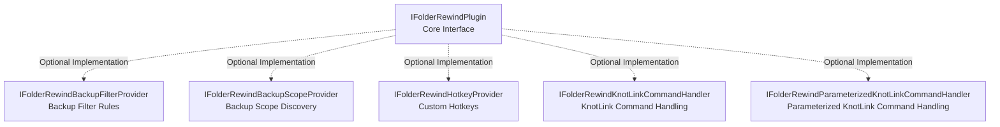
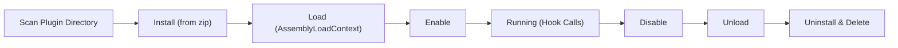

# Plugin System

## Interface Hierarchy

The plugin system is built around the core `IFolderRewindPlugin` interface, supplemented by optional extension interfaces:

- **`IFolderRewindBackupFilterProvider`** — Allows a plugin to contribute filtering rules (whitelist/blacklist) for a single backup run. The host clones the config before applying these rules, so the user's saved configuration is never polluted.
- **`IFolderRewindBackupScopeProvider`** — Allows a plugin to declare new "backup scope / filter strategies" (e.g. a Minecraft region), which are converted into host-executable filter rules at backup time. Parameters are dynamically rendered by the host and stored in `BackupConfig`.
- **`IFolderRewindHotkeyProvider`** — Custom hotkeys.
- **`IFolderRewindKnotLinkCommandHandler`** — Extends FolderRewind's KnotLink command set.
- **`IFolderRewindParameterizedKnotLinkCommandHandler`** — Participates in the new parameterized KnotLink commands, coexisting with the legacy interface so that older plugins do not need to recompile when the host upgrades.

### Core Interface `IFolderRewindPlugin`

The core interface every plugin must implement, defining:

- **Lifecycle hooks**: `Initialize(settingsValues)` — called once by the host when the plugin is enabled (unloading is managed by the host; plugins do not implement an unload method)
- **Backup/restore hooks**: `OnBeforeBackupFolder()` / `OnAfterBackupFolder()` / `OnBeforeRestoreFolder()` / `OnAfterRestoreFolder()`
- **Full takeover**: `WantsToHandleBackup()` / `PerformBackupAsync()` / `WantsToHandleRestore()` / `PerformRestoreAsync()` — a plugin can fully take over the backup/restore flow for a specific configuration
- **Config type discovery**: `GetSupportedConfigTypes()` — returns the list of configuration types this plugin supports
- **Settings page contribution**: `GetSettingsDefinitions()` — defines optional plugin settings; the host persists the values entered by the user

## Lifecycle

- **Scan**: `PluginService` scans the plugin directory on startup
- **Install**: Supports installation from a zip package, automatically extracted to the plugin directory
- **Load**: Uses `AssemblyLoadContext` for isolated plugin loading
- **Enable / Disable**: Runtime toggle, no application restart required
- **Version checking**: Plugin update checks via GitHub Release
- **Settings persistence**: Plugin settings are persisted and managed by the host application

## Plugin Isolation

Implemented using .NET's `AssemblyLoadContext`:

- Each plugin is loaded in its own AssemblyLoadContext
- Plugin dependencies do not conflict with the host or other plugins
- Loaded assemblies can be released when a plugin is unloaded (supports hot-update scenarios)

## KnotLink Protocol

KnotLink is a TCP-based remote command/event protocol, inherited from MineBackup:

- **Signal Sender** (`SignalSender`): sends backup/restore event notifications to external tools
- **Signal Subscriber** (`SignalSubscriber`): listens for commands from external tools
- **Command Parser** (`KnotLinkCommandParser`): parses TCP messages into structured commands
- **TCP Communication** (`TcpClient`, `OpenSocketQuerier`, `OpenSocketResponser`): low-level network communication

Typical scenario: a Minecraft mod triggers a hot backup / hot restore while the game is running.

## Reference Plugin: MineRewind

`FolderRewind-Plugin-Minecraft/MineRewind/` is the official Minecraft save management plugin and serves as a reference implementation for plugin development:

- Implements the full takeover capability of `IFolderRewindPlugin`
- Handles Minecraft-specific backup/restore logic
- Integrates KnotLink command handling
