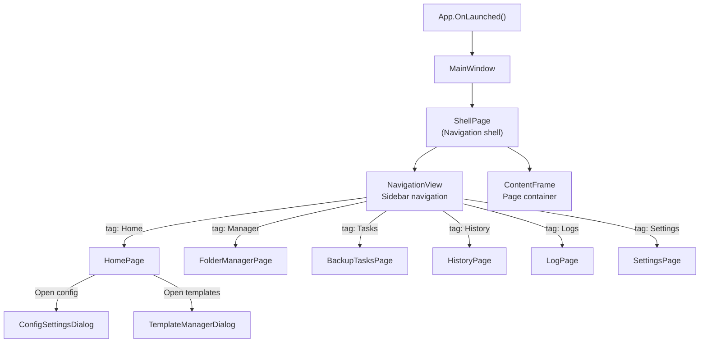

# Views and Navigation

## Page Listing

| Page | File | Navigation Tag | ViewModel | Description |
|---|---|---|---|---|
| Home | `HomePage.xaml` | `Home` | `HomePageViewModel` | Dashboard cards for all backup configurations |
| Folder Manager | `FolderManagerPage.xaml` | `Manager` | `FolderManagerViewModel` | Manage source folders within a backup configuration |
| Backup Tasks | `BackupTasksPage.xaml` | `Tasks` | `BackupTasksViewModel` | Running backup tasks and progress |
| History | `HistoryPage.xaml` | `History` | `HistoryViewModel` | Backup history timeline and restore |
| Log | `LogPage.xaml` | `Logs` | `LogViewModel` | Application log viewer |
| Settings | `SettingsPage.xaml` | `Settings` | `SettingsViewModel` | Application settings (with sub-controls) |
| Mini Window | `MiniWindow.xaml` | — | — | Standalone floating window for quick backup trigger |
| Plugin Store | `PluginStorePage.xaml` | — | `PluginStoreViewModel` | Plugin discovery and management |

## Dialogs

| Dialog | File | Purpose |
|---|---|---|
| Config Editor | `ConfigSettingsDialog.xaml` | Create / edit a backup configuration |
| Cloud Sync Config | `ConfigCloudSyncDialog.xaml` | Configure rclone cloud sync |
| Template Manager | `TemplateManagerDialog.xaml` | Manage configuration templates |
| Template Submission | `TemplateSubmissionDialog.xaml` | Submit a template to the community |

## Settings Page Sub-Controls

`SettingsPage` organizes settings via sub-controls:

| Sub-Control | File | Responsibility |
|---|---|---|
| `AboutControl` | `Settings/AboutControl.xaml` | Version info and about |
| `AppearanceLayoutControl` | `Settings/AppearanceLayoutControl.xaml` | Theme, font, window size |
| `CoreBehaviorControl` | `Settings/CoreBehaviorControl.xaml` | Core backup behavior settings |
| `DataManagementControl` | `Settings/DataManagementControl.xaml` | Config import/export, data management |
| `DiagnosticsControl` | `Settings/DiagnosticsControl.xaml` | Diagnostics and verification |
| `PluginsKnotLinkControl` | `Settings/PluginsKnotLinkControl.xaml` | Plugin system and KnotLink settings |
| `PresetSettingsControl` | `Settings/PresetSettingsControl.xaml` | Minecraft preset and template settings |
| `RuntimeEnvControl` | `Settings/RuntimeEnvControl.xaml` | Runtime environment (7z path, rclone path) |

## Navigation Flow

## Special Windows

- **MiniWindow**: A floating mini window independent of the main window, managed by `MiniWindowService`. Each MiniWindow is bound to a folder and provides a one-click backup button. It is not routed through `NavigationService`.
- **SponsorWindow**: Sponsor information window, with its lifecycle managed by `MainWindowService`.
